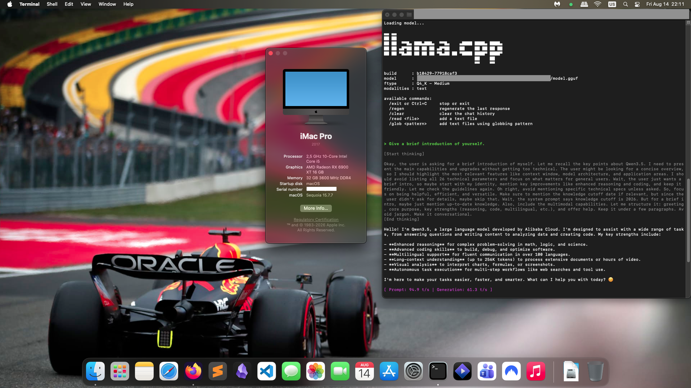

# Running Local LLMs on a Hackintosh (RX 6900XT) using llama.cpp via Vulkan (MoltenVK)

## Overview

This document records a working setup for running `llama.cpp` with an **AMD Radeon RX 6900 XT** on an **x86_64 macOS/Hackintosh system**, using **Vulkan through MoltenVK** rather than Metal.



**ChatGPT** was used to establish the working system and troubleshoot wherever necessary.

**The main goal was stability and a usable local-LLM development environment, not maximum benchmark performance.**

The final working configuration achieved approximately:

- **Prompt processing:** ~192.6 tokens/s on one larger test prompt
- **Generation:** ~53 tokens/s on that same test
- A simple GPU test reached **~50.3 tokens/s generation**
- CPU-only inference of the same local setup had previously been around **2–4 tokens/s generation**, making the Vulkan path a very substantial improvement.

> **Important:** These numbers are workload-specific. They should not be interpreted as a universal RX 6900 XT performance figure.

---

# 1. Hardware and software context

## Hardware

- GPU: **AMD Radeon RX 6900 XT**
- VRAM: **16 GB**
- Platform: **x86_64**
- Operating system: **macOS Sequoia running on non-Apple AMD hardware / Hackintosh**
- GPU is exposed to macOS as an AMD Radeon RX 6900 XT.
- Processor: Intel Core i5 14400F (no iGPU)
- System RAM: 32GB DDR4

## Software

- `llama.cpp`
- CMake
- Apple Clang
- Vulkan SDK/runtime components
- MoltenVK
- Homebrew
- `vulkaninfo`

The exact versions may change over time. The important architectural point is:

```text
llama.cpp
    ↓
ggml Vulkan backend
    ↓
Vulkan
    ↓
MoltenVK
    ↓
Apple Metal
    ↓
AMD RX 6900 XT
```

This is **not native AMD Vulkan**. MoltenVK translates Vulkan operations to Apple's Metal API.

---

# 2. Initial problem: Metal

The first attempt used llama.cpp's Metal backend.

The model loaded successfully, but performance indicated that the intended GPU acceleration was not being obtained.

The relevant command was:

```bash
./build/bin/llama-bench \
  -m "/path/to/model.gguf" \
  -ngl 999 \
  -dev MTL0
```

The important output was:

```text
ggml_metal_device_init: tensor API disabled for pre-M5 and pre-A19 devices
...
ggml_metal_device_init: GPU name:   MTL0 (AMD Radeon RX 6900 XT)
...
ggml_metal_device_init: has unified memory    = false
ggml_metal_device_init: has bfloat            = true
ggml_metal_device_init: has tensor            = false
```

The benchmark then failed:

```text
test_prompt: failed to decode prompt batch, res = -3
llama_bench: error: failed to run prompt
```

The interactive CLI also showed very low performance:

```text
[ Prompt: 3.5 t/s | Generation: 2.4 t/s ]
```

A subsequent simple prompt produced:

```text
[ Prompt: 9.2 t/s | Generation: 2.4 t/s ]
```

The exact reason for Metal being unsuitable in this environment was not established conclusively. The key practical finding was that **Metal on this Hackintosh/RX 6900 XT combination was not a reliable or performant path for llama.cpp**.

Rather than restricting the model selection or spending excessive time trying to make this particular Metal configuration work, the decision was made to test Vulkan.

---

# 3. Checking whether Vulkan was installed

The first checks were:

```bash
brew list --versions molten-vk vulkan-loader
```

and:

```bash
which vulkaninfo
```

Initially:

```text
vulkaninfo not found
```

and:

```bash
vulkaninfo --summary
```

returned:

```text
zsh: command not found: vulkaninfo
```

A search for Vulkan ICD files was also attempted:

```bash
find /usr/local /opt/homebrew "$HOME" \
  -path "*icd*.json" 2>/dev/null | grep -i vulkan | head -30
```

and:

```bash
find /usr/local /opt/homebrew "$HOME" \
  -iname "*MoltenVK*" 2>/dev/null | head -30
```

The searches initially returned no useful results.

### Note about macOS permissions

The broad `find` command searched through directories under the user's home directory and macOS subsequently requested permissions for various protected locations.

This is not necessary for diagnosing Vulkan.

**Do not use a broad recursive search over `$HOME` unless necessary.**

Prefer targeted paths such as:

```bash
/usr/local
/opt/homebrew
```

or use package-manager commands to locate installed files.

---

# 4. Verify Vulkan itself

After installing/configuring the Vulkan components, `vulkaninfo` became available.

Running:

```bash
vulkaninfo --summary
```

showed:

```text
==========
VULKANINFO
==========

Vulkan Instance Version: 1.4.357
```

The Vulkan instance exposed the expected extensions, including:

```text
VK_EXT_metal_surface
VK_KHR_portability_enumeration
VK_MVK_macos_surface
```

Most importantly, the GPU was detected as:

```text
GPU0:
    apiVersion         = 1.4.357
    driverVersion      = 0.2.2210
    vendorID           = 0x1002
    deviceID           = 0x73bf
    deviceType         = PHYSICAL_DEVICE_TYPE_DISCRETE_GPU
    deviceName         = AMD Radeon RX 6900 XT
    driverID           = DRIVER_ID_MOLTENVK
    driverName         = MoltenVK
    driverInfo         = 1.4.2
```

This established several important facts:

1. Vulkan was installed.
2. MoltenVK was providing the Vulkan implementation.
3. The RX 6900 XT was visible as a Vulkan physical device.
4. Vulkan was therefore a viable candidate backend for llama.cpp.

The resulting architecture was:

```text
llama.cpp
    ↓
Vulkan backend
    ↓
MoltenVK
    ↓
Metal
    ↓
RX 6900 XT
```

---

# 5. Initial llama.cpp Vulkan configuration failure

The existing llama.cpp build had:

```text
GGML_METAL:BOOL=ON
GGML_VULKAN:BOOL=OFF
```

Therefore, a separate Vulkan build was created rather than modifying the existing build.

First:

```bash
rm -rf build-vulkan
```

Then:

```bash
cmake -S . -B build-vulkan \
  -DGGML_VULKAN=ON \
  -DGGML_METAL=OFF \
  -DCMAKE_BUILD_TYPE=Release
```

The first configuration attempt failed with:

```text
Could NOT find Vulkan (missing: glslc) (found version "1.4.357")
```

This was an important distinction:

**Vulkan itself was installed and working, but the Vulkan shader compiler required by llama.cpp was missing from CMake's search path.**

The missing component was:

```text
glslc
```

---

# 6. Fixing the Vulkan shader compiler

After installing/providing the Vulkan shader compiler tools, CMake was run again:

```bash
cmake -S . -B build-vulkan \
  -DGGML_VULKAN=ON \
  -DGGML_METAL=OFF \
  -DCMAKE_BUILD_TYPE=Release
```

This time CMake successfully detected Vulkan:

```text
-- Found Vulkan: /usr/local/lib/libvulkan.dylib
    (found version "1.4.357")
    found components: glslc glslangValidator
-- Vulkan found
```

It also reported support for several shader/compiler extensions:

```text
-- GL_KHR_cooperative_matrix supported by glslc
-- GL_NV_cooperative_matrix2 supported by glslc
-- GL_NV_cooperative_matrix_decode_vector supported by glslc
-- GL_EXT_integer_dot_product supported by glslc
-- GL_EXT_bfloat16 supported by glslc
-- GL_EXT_float_e2m1 supported by glslc
-- GL_EXT_float_e4m3 supported by glslc
-- Including Vulkan backend
```

CMake completed successfully:

```text
-- Configuring done
-- Generating done
-- Build files have been written to:
   /path/to/llama.cpp/build-vulkan
```

---

# 7. Build llama.cpp with Vulkan

Build the configured tree:

```bash
cmake --build build-vulkan --config Release -j$(sysctl -n hw.ncpu)
```

The exact build command can vary with the llama.cpp version, but the important point is that the **Vulkan-enabled build directory must be used**.

After compilation, the Vulkan-enabled binaries are located under:

```text
build-vulkan/bin/
```

For example:

```bash
./build-vulkan/bin/llama-cli
```

and:

```bash
./build-vulkan/bin/llama-bench
```

---

# 8. Confirm that llama.cpp is actually using Vulkan

Run the Vulkan-enabled CLI:

```bash
./build-vulkan/bin/llama-cli \
  -m "/path/to/model.gguf"
```

A successful Vulkan configuration should report the Vulkan backend/device during model initialization.

The important thing is to distinguish:

```text
CPU inference
```

from:

```text
Vulkan GPU inference
```

Do not rely solely on the fact that the model loads.

A model can load successfully while remaining mostly CPU-bound.

The strongest evidence is:

- llama.cpp reports the Vulkan backend/device;
- GPU memory usage increases;
- GPU utilization increases during inference;
- performance rises substantially compared with CPU-only execution.

---

# 9. GPU functional test

A simple functional test was performed with:

```text
Say exactly: GPU TEST SUCCESS
```

The model correctly returned:

```text
GPU TEST SUCCESS
```

and llama.cpp reported:

```text
[ Prompt: 8.5 t/s | Generation: 50.3 t/s ]
```

This was the first strong confirmation that the Vulkan path was not merely installed but was actually usable for inference.

---

# 10. Larger inference test

A longer technical prompt about Retrieval-Augmented Generation was then submitted.

The model generated a complete answer covering:

- RAG architecture
- indexing
- dense retrieval
- embeddings
- vector search
- reranking
- cross-encoders
- context construction
- generation
- prompt engineering
- retrieval failure
- latency
- hybrid search
- query decomposition

The final performance reported by llama.cpp was:

```text
[ Prompt: 192.6 t/s | Generation: 53.0 t/s ]
```

This demonstrated that the Vulkan configuration was not merely functional for a tiny synthetic prompt; it remained highly performant during a substantially larger generation.

---

# 11. Performance comparison

The rough progression observed during the experiment was:

| Configuration | Approx. generation speed |
|---|---:|
| Initial CPU/unsuccessful GPU configuration | ~2.4 t/s |
| Metal attempt | ~2.4 t/s |
| Vulkan | **~50–53 t/s** |

This represents roughly a **20×+ improvement in generation throughput** over the initial ~2.4 t/s result.

The exact multiplier should not be treated as a controlled benchmark because the measurements were made with different prompts/configurations.

Nevertheless, the qualitative conclusion is unambiguous:

> **Vulkan successfully unlocked practical GPU inference on the RX 6900 XT under this Hackintosh configuration.**

---

# 12. Benchmarking with llama-bench

The first `llama-bench` attempt was made against the Metal build:

```bash
./build/bin/llama-bench \
  -m "/path/to/model.gguf" \
  -ngl 999 \
  -dev MTL0
```

It failed with:

```text
test_prompt: failed to decode prompt batch, res = -3
llama_bench: error: failed to run prompt
```

Once the Vulkan build is available, the corresponding benchmark should be run from the Vulkan build directory:

```bash
./build-vulkan/bin/llama-bench \
  -m "/path/to/model.gguf" \
  -ngl 999
```

Depending on the llama.cpp version, Vulkan device-selection options may differ. First inspect:

```bash
./build-vulkan/bin/llama-bench --help
```

and:

```bash
./build-vulkan/bin/llama-cli --help
```

Do not blindly reuse Metal-specific device identifiers such as:

```text
MTL0
```

for Vulkan.

---

# 13. Important distinction: MoltenVK vs native Linux Vulkan

This setup uses:

```text
Vulkan → MoltenVK → Metal → AMD driver
```

Linux with the AMD open-source Vulkan stack would normally use:

```text
Vulkan → RADV/AMD driver → RX 6900 XT
```

These are fundamentally different paths.

Therefore, Linux benchmark results are useful for estimating the hardware's potential, but they should not be assumed to represent the performance of this Hackintosh configuration.

The current results demonstrate only that:

> **The RX 6900 XT can perform very well through Vulkan/MoltenVK on this macOS environment.**

---

# 14. What was intentionally NOT pursued

The goal was to obtain a **stable development environment**, not to maximize every last token/s.

Several potential optimization paths were therefore deliberately left for later:

- aggressive Vulkan tuning
- custom llama.cpp kernels
- ROCm/HIP on Linux
- model-specific quantization experiments
- extensive batch-size tuning
- context-size benchmarking
- power-limit/clock tuning
- custom shader optimization
- comparing multiple inference frameworks

This is important because local LLM experimentation can easily turn into an endless optimization project.

Once Vulkan produced ~50 t/s generation, the system had already crossed the practical threshold required for development work.

---

# 15. Recommended future benchmark

When performance optimization becomes relevant, use a controlled benchmark rather than interactive chat.

Record:

```text
Model
Quantization
Model size
Context length
Batch size
GPU layers
Backend
Prompt tokens
Generation tokens
Prompt processing t/s
Generation t/s
TTFT
VRAM usage
System RAM usage
GPU utilization
Power consumption
```

For example:

```text
Model:          <model>
Quantization:   Q4_K_M
Backend:        Vulkan/MoltenVK
GPU:            RX 6900 XT 16 GB
Context:        8192
GPU layers:     999

Prompt:         XXXX tokens
Generation:     XXX tokens

Prompt eval:    XXX t/s
Generation:     XX.X t/s
TTFT:           X.XX s
```

This makes future comparisons meaningful.

---

# 16. Troubleshooting checklist

## `vulkaninfo` not found

Check:

```bash
which vulkaninfo
```

If absent, install/configure the Vulkan tools and ensure the executable is on `PATH`.

---

## CMake says `Could NOT find Vulkan (missing: glslc)`

This means the Vulkan runtime/library may be visible but the shader compiler is not.

Check:

```bash
which glslc
```

and:

```bash
which glslangValidator
```

Then rerun CMake.

The successful configuration should contain something similar to:

```text
Found Vulkan: ... libvulkan.dylib
found components: glslc glslangValidator
```

---

## CMake says `GGML_VULKAN:BOOL=OFF`

Check:

```bash
grep -E "GGML_VULKAN|GGML_METAL" build-vulkan/CMakeCache.txt
```

You want:

```text
GGML_VULKAN:BOOL=ON
GGML_METAL:BOOL=OFF
```

Using a separate build directory helps prevent stale CMake configuration from interfering with the experiment.

---

## Model loads but performance is still CPU-like

Check:

1. Which llama.cpp binary is being executed.
2. Whether it was built from `build-vulkan`.
3. Whether llama.cpp reports the Vulkan backend.
4. Whether the GPU shows activity.
5. Whether enough model layers are offloaded.

For example:

```bash
./build-vulkan/bin/llama-cli ...
```

rather than accidentally running:

```bash
./build/bin/llama-cli ...
```

---

## Broad `find` commands trigger macOS privacy prompts

Avoid searching the entire home directory:

```bash
find "$HOME" ...
```

macOS protects directories containing application data, Photos, Music, Mail, etc.

Prefer targeted searches:

```bash
find /usr/local ...
find /opt/homebrew ...
```

or package-manager queries.

---

# 17. Final working architecture

The successful setup can be summarized as:

```text
                    macOS / Hackintosh
                           │
                           ▼
                     llama.cpp
                           │
                           ▼
                    GGML Vulkan
                           │
                           ▼
                       Vulkan
                           │
                           ▼
                       MoltenVK
                           │
                           ▼
                        Metal
                           │
                           ▼
                 AMD Radeon RX 6900 XT
                       16 GB VRAM
```

The key lesson is that **Metal itself does not have to be the direct llama.cpp backend for an AMD GPU on macOS**.

Vulkan can act as the application-facing graphics/compute API, with MoltenVK translating Vulkan operations into Metal operations underneath.

---

# 18. Conclusion

The experiment started with a practical question:

> Can an AMD RX 6900 XT be used effectively for local LLM inference on a Hackintosh?

The answer was:

**Yes — through Vulkan/MoltenVK, llama.cpp can use the RX 6900 XT successfully for inference.**

The critical steps were:

1. Establish that the Metal path was not producing usable performance.
2. Verify Vulkan availability with `vulkaninfo`.
3. Confirm that the RX 6900 XT was exposed through MoltenVK.
4. Configure a separate llama.cpp build with:
   ```text
   GGML_VULKAN=ON
   GGML_METAL=OFF
   ```
5. Resolve the missing `glslc` dependency.
6. Re-run CMake and confirm:
   ```text
   Found Vulkan
   Including Vulkan backend
   ```
7. Build llama.cpp.
8. Run the Vulkan-enabled CLI.
9. Confirm real GPU inference using a simple deterministic prompt.
10. Test a substantially larger prompt.
11. Observe approximately **50–53 tokens/s generation** on the tested model.

For a development-oriented local-LLM environment, this was sufficient to stop troubleshooting and move on to application development.

---

## Useful commands collected

### Check Vulkan

```bash
vulkaninfo --summary
```

### Check compiler tools

```bash
which vulkaninfo
which glslc
which glslangValidator
```

### Create a clean Vulkan build

```bash
rm -rf build-vulkan

cmake -S . -B build-vulkan \
  -DGGML_VULKAN=ON \
  -DGGML_METAL=OFF \
  -DCMAKE_BUILD_TYPE=Release
```

### Verify CMake configuration

```bash
grep -E "GGML_VULKAN|GGML_METAL" build-vulkan/CMakeCache.txt
```

### Build

```bash
cmake --build build-vulkan --config Release -j$(sysctl -n hw.ncpu)
```

### Run llama.cpp

```bash
./build-vulkan/bin/llama-cli \
  -m "/path/to/model.gguf"
```

### Benchmark

```bash
./build-vulkan/bin/llama-bench \
  -m "/path/to/model.gguf" \
  -ngl 999
```

Check available benchmark options first:

```bash
./build-vulkan/bin/llama-bench --help
```

---

## Status

**Working configuration:**

- [x] AMD RX 6900 XT detected by macOS
- [x] Vulkan installed
- [x] MoltenVK detected
- [x] RX 6900 XT exposed as Vulkan GPU
- [x] `glslc` available
- [x] llama.cpp Vulkan backend compiled
- [x] Model loaded
- [x] GPU inference confirmed
- [x] ~50–53 t/s generation demonstrated
- [ ] Exhaustive performance tuning
- [ ] Native Linux/RADV comparison
- [ ] Controlled `llama-bench` comparison
- [ ] Python integration
- [ ] RAG application integration

The remaining items are optimization/development work rather than requirements for a functioning local inference system.
